

## Experience

    

    
<strong></strong>

    
<strong>Firm</strong>

    
<strong>Role</strong>

    
<strong>Year</strong>

    

  

    

    
Salesforce Inc.

    
Summer Intern

    
upcoming!

  

  

    

    
Tata Institute of Fundamental Research

    
VSRP Scholar

    
2024

  

## Courses I Took
(read: survived)

  
<strong>
  &nbsp;&nbsp;&nbsp;&nbsp;&nbsp;&nbsp;&nbsp;&nbsp;&nbsp;&nbsp;&nbsp;&nbsp;&nbsp;&nbsp;&nbsp;&nbsp;&nbsp;&nbsp;&nbsp;&nbsp;&nbsp;&nbsp;&nbsp;
  <!-- This is peak HTML. -->
  </strong>

  
<strong>Code</strong>

  
<strong>Name</strong>

  
<strong>Remark!?</strong>

  

    
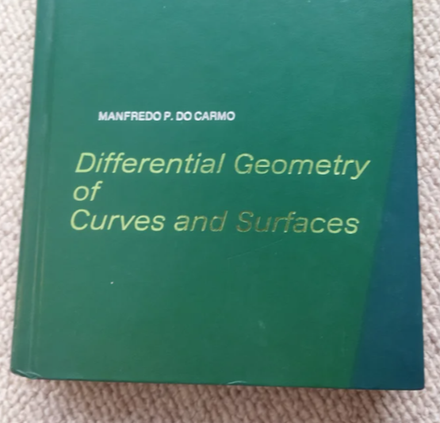

    
MA411

    
Differential Geometry

    
So pissed at morning labs.

  

  

    
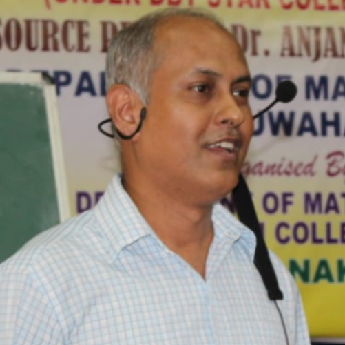

    
MA641

    
Operator Theory on Hilbert Spaces

    
He's actually the best.

  

  
  
  

    
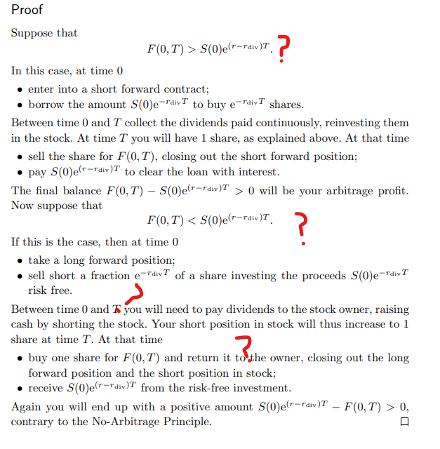

    
MA271

    
Financial Engineering

    
Ew.

  

  

    
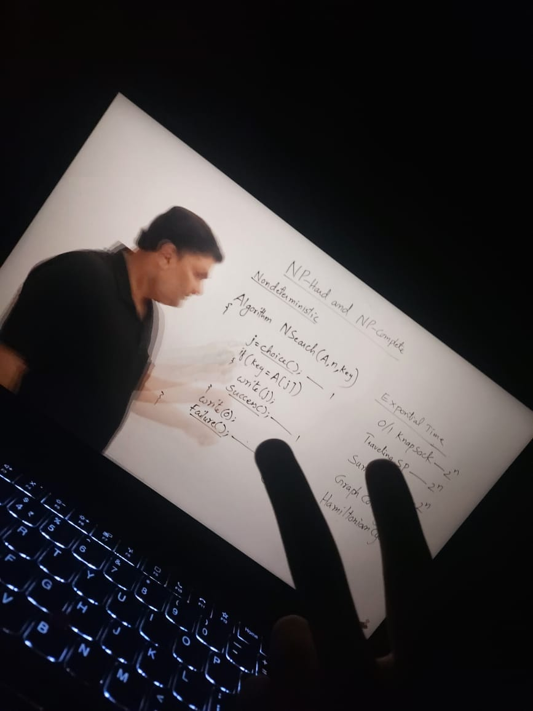

    
MA252

    
Algorithm Design and Anal.

    
Meh.

  

  

    
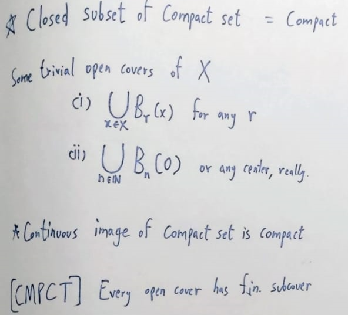

    
MA224

    
Real Anal. and Measure Theory

    
Lebesgue you too.

  

  

    
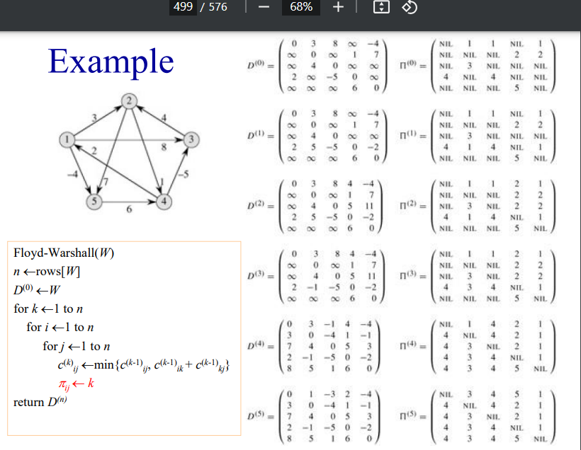

    
MA251

    
Data Structures

    
Meh. But good lab.

  

  

    
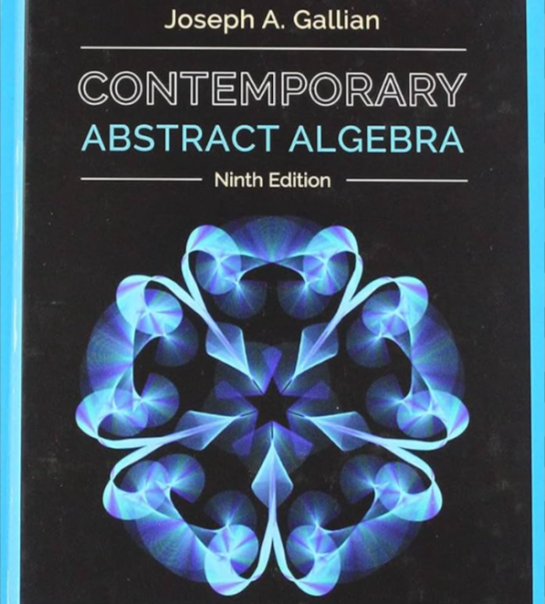

    
MA222

    
Abstract Algebra, Number Theory

    
Ring around the rosie. Had fun.

  

  

    
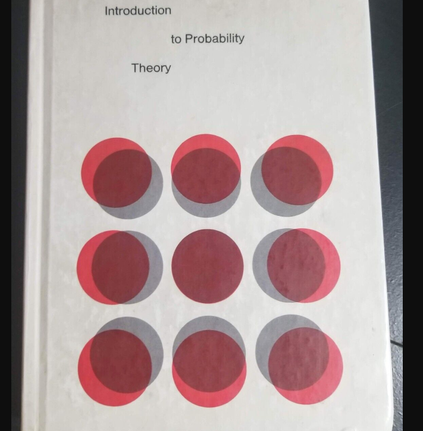

    
MA225

    
Probability Theory

    
uwu can i haz qwant?

  

  

    
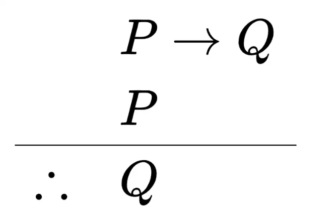

    
MA221

    
Discrete Math

    
Very vintage. Had fun.

  

  

    
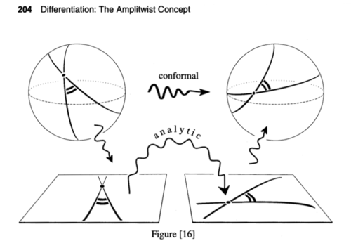

    
MA201

    
Complex Anal. and PDEs

    
Tristan Needham told me all I'll remember.

  

  

    
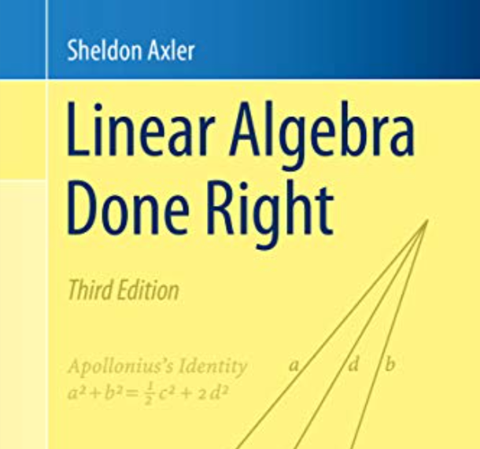

    
MA102

    
Linear Algebra and ODEs

    
I thank Axler wholeheartedly.

  

  

    
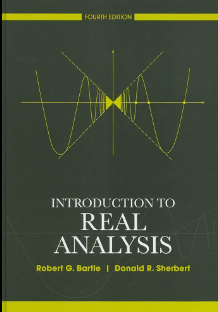

    
MA101

    
Real Anal. and Multivariate Calc

    
You are crushed and born anew.

  

## Education

  
<strong>School</strong>

  
<strong>Name</strong>

  
<strong>Degree</strong>

  
<strong>Year</strong>

  

    

    
IIT Guwahati

    
Mathematics and Computing, B.Tech

    
2026

  

  

    

    
THS Rohini

    
High School, CBSE

    
2022

  

<!-- 
## Experience

| Icon                                    | Firm       | Role  | Details | Year |
|-----------------------------------------|------------|-------|---------|------|
|     | Salesforce | Intern|         | 2025 |
|     | TIFR       | VSRP  |         | 2024 |

## Courses I took
(read: survived)

| Text | Code  | Name                                  | Remark!?                                    |
|------|-------|---------------------------------------|---------------------------------------------|
|      | MA411 | Differential Geometry                 | So pissed at morning labs.                  |
|      | MA641 | Operator Theory on Hilbert Spaces     | He's actually the best.                     |
|      | MA271 | Financial Engineering                 | Ew.                                         |
|      | MA252 | Algorithm Design and Anal.            | Meh.                                        |
|      | MA224 | Real Anal. and Measure Theory         | Tip my hat to Cantor.                       |
|      | MA251 | Data Structures                       | Meh. But good lab.                          |
|      | MA222 | Abstract Algebra, Number Theory       | Ring around the rosie. Had fun.             |
|      | MA225 | Probability Theory                    | uwu can i haz qwant?                        |
|      | MA221 | Discrete Math                         | Very vintage. Had fun.                      |
|      | MA201 | Complex Anal. and PDEs                | Tristan Needham told me all I remember.     |
|      | MA102 | Linear Algebra and ODEs               | I thank Axler wholeheartedly.               |
|      | MA101 | Real Anal. and Multivariate Calculus  | You are crushed and born anew.              |

## Education

|      | Name          | Degree                               | Year |
|------|---------------|--------------------------------------|------|
|      | IIT Guwahati  | Mathematics and Computing, B.Tech    | 2026 |
|      | THS Rohini    | High School, CBSE                    | 2022 |
-->
